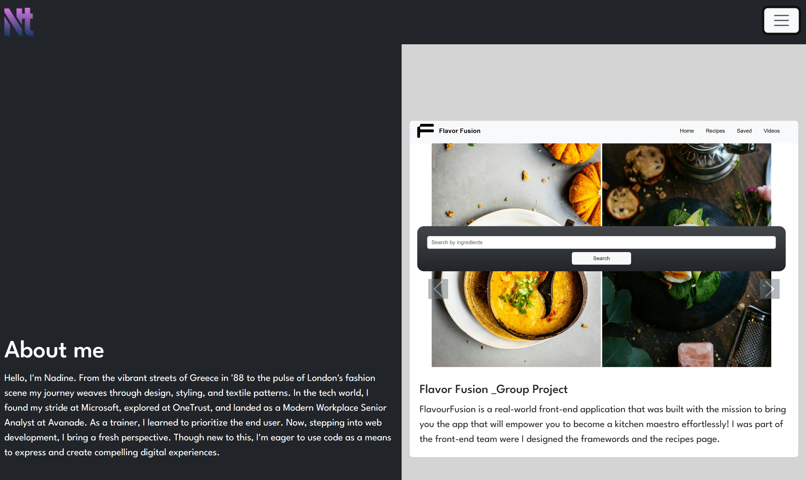
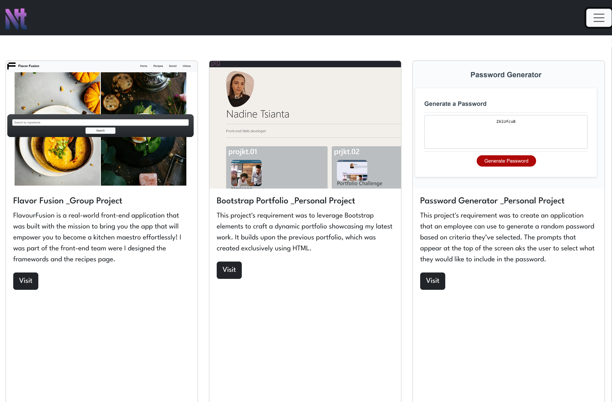
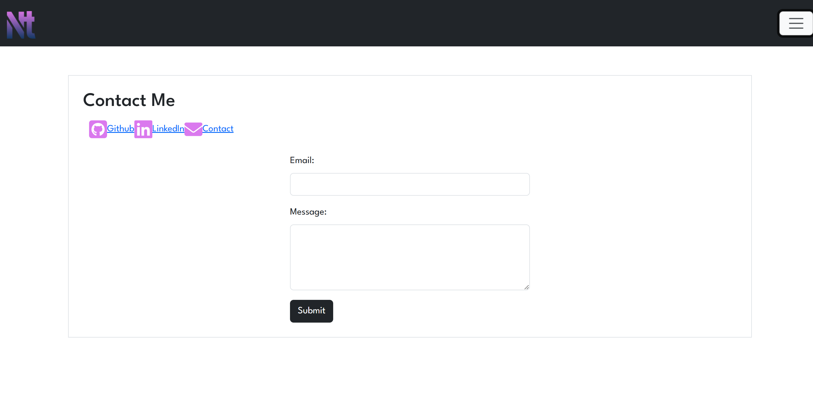
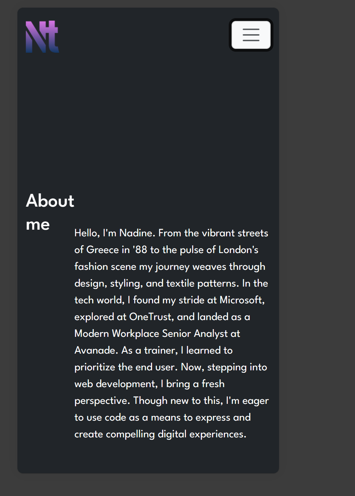
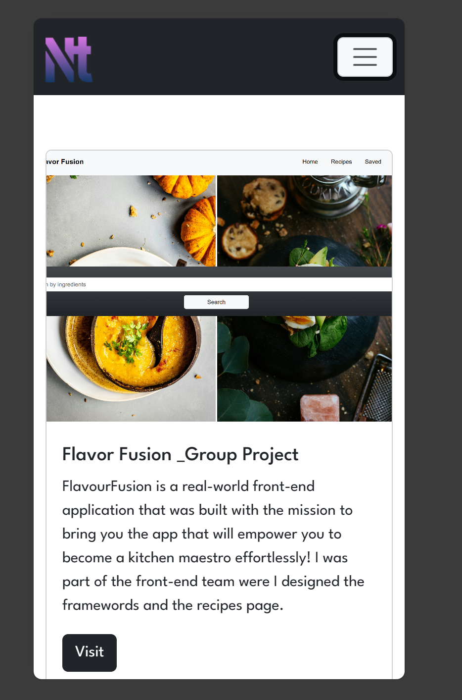
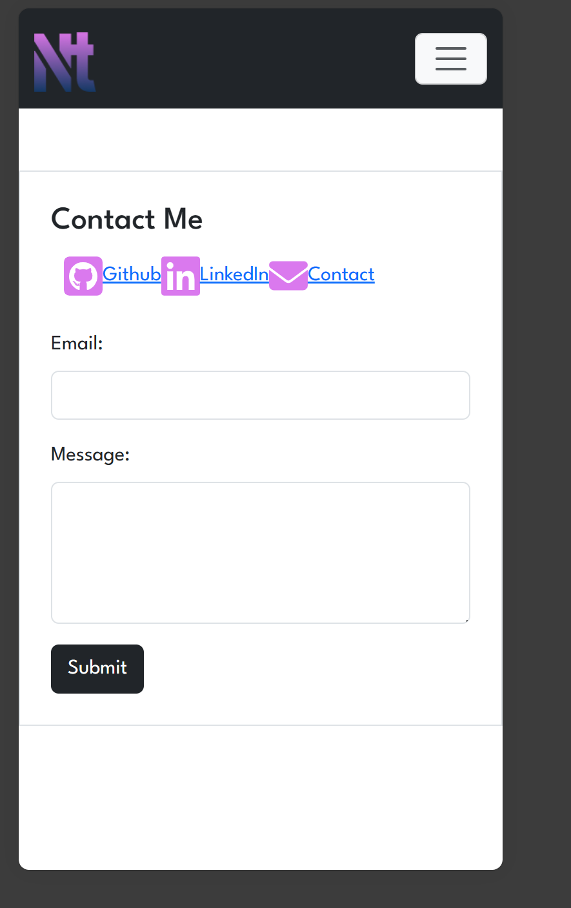

# React Portfolio

## Description

The objective of this project was to leverage React for the redesign of our existing portfolio. In our previous portfolio project, Bootstrap was employed to enhance the design of the portfolio page. With the introduction of React, the portfolio was an ideal candidate for exploration, allowing us to grasp contemporary coding practices and the advantages of breaking down projects into smaller components.

The React portfolio operates on a single HTML page, contributing to enhanced speed and efficiency for future modifications. This approach enables precise targeting of components, eliminating the need for alterations across the entire page when making specific changes. This modular structure not only aligns with modern coding practices but also facilitates a more streamlined and maintainable development process.

- Motivation:
The primary motivation behind embarking on this project was to transition from our previous portfolio, which utilized Bootstrap, to a more modern and efficient design using React. React's component-based structure offered an opportunity to delve into contemporary coding practices and enhance our understanding of this powerful library.

- Reason for Building:
The decision to build the portfolio using React was driven by the desire to stay current with modern web development practices. This project served as a practical application of the knowledge gained in our introduction to React, providing a real-world scenario to reinforce our learning.

- Problem Solving:
The project addresses the need for a more scalable and maintainable portfolio. By utilizing React's component-based architecture, the portfolio becomes more modular. This modularity allows for targeted changes without affecting the entire page, providing a solution to potential challenges associated with future updates and modifications.

- Learning Outcomes:
Through this project, I gained a deeper understanding of React's capabilities and how it can be effectively employed to streamline web development. The transition from a monolithic structure to a component-based approach taught me the importance of modular design for efficient code maintenance. Additionally, the project honed my skills in targeting and manipulating specific components, contributing to a more nuanced understanding of React's functionality.

## Table of Contents (Optional)

If your README is long, add a table of contents to make it easy for users to find what they need.

- [Installation](#installation)
- [Contributing](#contributing)
- [License](#license)

## Installation

```bash
npm create vite@latest
npm i -D react-router-dom@latest
```


## Contributing
For changes, please open an issue first to discuss what you would like to chaneg. 


## License

[MIT](https://choosealicense.com/licenses/mit/)


## Features
Full screen screenshots




Mobile Screen screenshots





